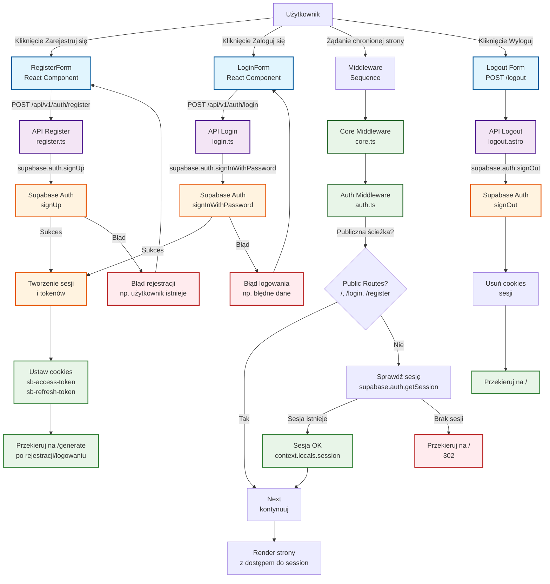

# Diagram przepływu procesu uwierzytelniania

## Opis diagramu

Diagram przedstawia kompletny przepływ procesu uwierzytelniania w aplikacji 10xCards, obejmujący:

1. **Rejestrację użytkownika** - proces tworzenia nowego konta
2. **Logowanie** - proces uwierzytelniania istniejącego użytkownika
3. **Middleware autoryzacji** - sprawdzanie dostępu do chronionych zasobów
4. **Wylogowanie** - zakończenie sesji użytkownika

### Kluczowe komponenty systemu

- **Frontend** - Komponenty React (LoginForm, RegisterForm) i strony Astro (login.astro, register.astro)
- **Backend** - Endpointy API Astro (/api/v1/auth/*)
- **Middleware** - Core middleware (inicjalizacja Supabase) i Auth middleware (sprawdzanie sesji)
- **Supabase Auth** - Zarządzanie użytkownikami, sesjami i tokenami
- **Cookies** - Przechowywanie tokenów sesji po stronie klienta

### Przepływy

#### Rejestracja

Użytkownik → RegisterForm → API /register → Supabase Auth → Sesja → Cookies → Przekierowanie

#### Logowanie

Użytkownik → LoginForm → API /login → Supabase Auth → Sesja → Cookies → Przekierowanie

#### Dostęp do chronionych zasobów

Żądanie → Core Middleware → Auth Middleware → Sprawdzenie sesji → Dostęp lub przekierowanie

#### Wylogowanie

Użytkownik → Logout → API /logout → Supabase Auth → Usunięcie cookies → Przekierowanie

## Szczegółowy opis przepływów

### 1. Przepływ rejestracji

1. Użytkownik klika przycisk "Zarejestruj się" w `LandingNavigation.astro`
2. Przechodzi na stronę `/register.astro` zawierającą `RegisterForm` component
3. Wypełnia formularz (email, hasło, powtórz hasło) z walidacją po stronie klienta
4. Formularz wysyła POST do `/api/v1/auth/register`
5. Endpoint używa `supabase.auth.signUp()` z wyłączonym potwierdzeniem email
6. Supabase tworzy użytkownika i zwraca sesję
7. Cookies są ustawiane automatycznie przez `@supabase/ssr`
8. Użytkownik zostaje przekierowany na `/generate`

### 2. Przepływ logowania

1. Użytkownik klika przycisk "Zaloguj się" w `LandingNavigation.astro`
2. Przechodzi na stronę `/login.astro` zawierającą `LoginForm` component
3. Wypełnia formularz (email, hasło) z walidacją
4. Formularz wysyła POST do `/api/v1/auth/login`
5. Endpoint używa `supabase.auth.signInWithPassword()`
6. Supabase weryfikuje dane i zwraca sesję
7. Cookies są ustawiane
8. Użytkownik zostaje przekierowany na `/generate`

### 3. Przepływ autoryzacji (Middleware)

1. Każde żądanie przechodzi przez sekwencję middleware: `coreMiddleware` → `authMiddleware`
2. `coreMiddleware` inicjalizuje klienta Supabase server z obsługą cookies
3. `authMiddleware` sprawdza czy ścieżka jest publiczna
4. Dla ścieżek chronionych sprawdza sesję poprzez `supabase.auth.getSession()`
5. Jeśli sesja istnieje - ustawia `context.locals.session` i kontynuuje
6. Jeśli brak sesji - przekierowuje na stronę główną

### 4. Przepływ wylogowania

1. Użytkownik klika przycisk "Wyloguj" w nawigacji
2. Wysyłany jest POST do `/logout`
3. Endpoint wywołuje `supabase.auth.signOut()`
4. Supabase unieważnia sesję i usuwa cookies
5. Użytkownik zostaje przekierowany na stronę główną

## Techniczne szczegóły implementacji

### Middleware

- `coreMiddleware`: Inicjalizuje `context.locals.supabase` używając `createSupabaseServerClient`
- `authMiddleware`: Sprawdza sesję dla chronionych ścieżek, przekierowuje niezalogowanych

### API Endpoints

- Używają `supabase.server.ts` klienta
- Walidacja danych wejściowych przy użyciu Zod
- Obsługa błędów z odpowiednimi komunikatami

### Komponenty React

- `AuthForm`: Wspólny komponent bazowy dla formularzy
- `LoginForm`/`RegisterForm`: Specyficzne implementacje z walidacją
- Używają `react-hook-form` + `zod` dla walidacji
- Wyświetlają błędy przy użyciu `sonner`

### Supabase Auth

- Wyłączone potwierdzenie email dla natychmiastowego dostępu
- Automatyczna obsługa cookies przez `@supabase/ssr`
- Sesje zarządzane po stronie serwera

## Diagram Mermaid

